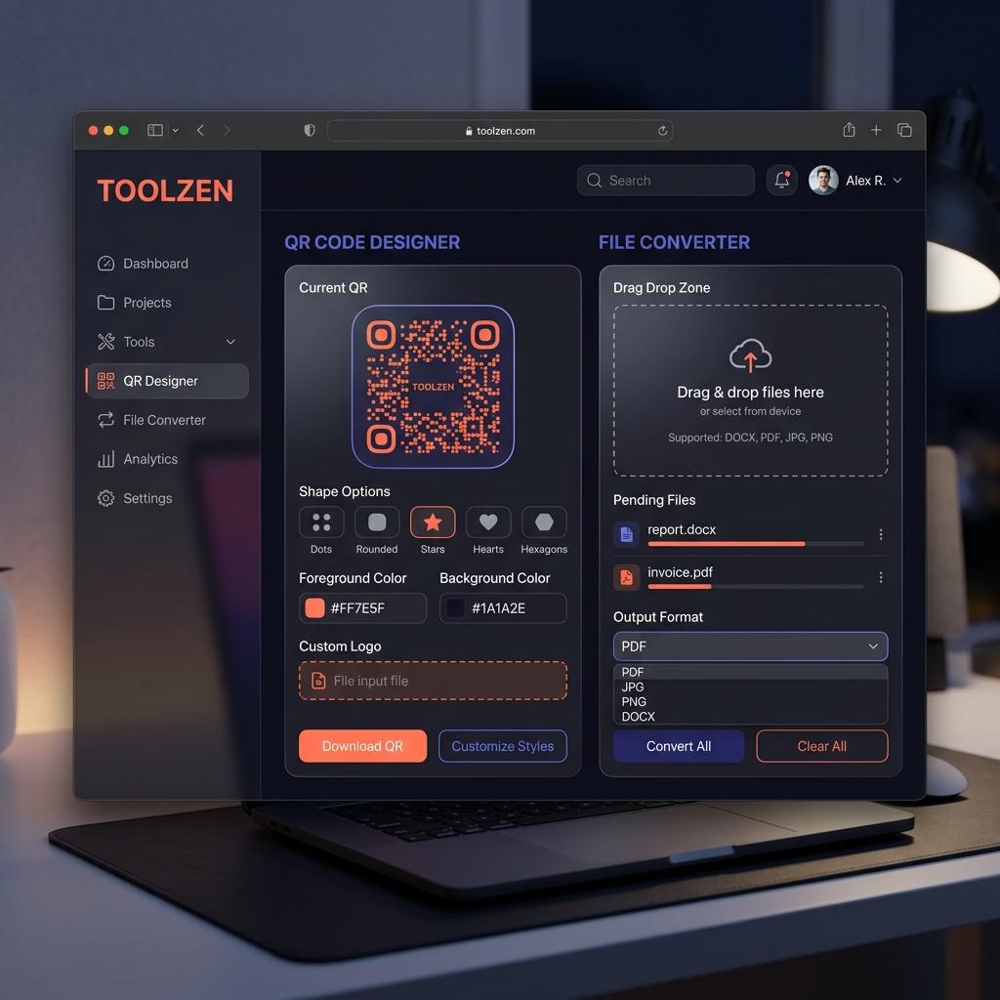

<!-- Animated Header Banner -->

<!-- Animated Typing SVG -->

 

<!-- Status Badges -->

 

<!-- Live Demo Button -->

 

---

## 🚀 The Ultimate Browser-Based Toolkit

**TOOLZEN** is a high-performance, privacy-first web application that centralizes all your essential digital tasks into one powerful dashboard. From designing sophisticated QR codes to converting complex file formats, **everything happens locally in your browser**.

> [!IMPORTANT]
> **Privacy First:** Your files are NEVER uploaded to any server. All processing is done 100% client-side using JavaScript, ensuring your sensitive data stays on your device.

---

## 💎 Key Features & Capabilities

| Category | High-Level Features | Tools |
|:---:|:---|:---:|
| 🎨 **Smart QR Designer** | 42+ Module Shapes · 18 Eye Styles · Gradient Overlays · Logo Branding · vCard & WiFi support | **50+ Options** |
| 🔄 **Elite File Converter** | Word ↔ PDF · PPT → PDF · Excel → PDF · JSON ↔ CSV · XML → JSON · Markdown → HTML | **50+ Formats** |
| 📦 **Advanced Compression** | Image (JPG/PNG/WebP) · PDF Size reduction · Batch ZIP creation | **Lossless Mode** |
| 🤖 **AI Assistant** | Claude-powered contextual chat · File analysis · Code explanation · Summary generation | **Built-in** |
| 🧰 **Super Utilities** | Unit/Currency Converter · GST Calculator · Text Diff · Meme Maker · Pomodoro Timer | **15+ Tools** |
| 📊 **Real-time Analytics** | Usage tracking · Conversion history · Performance metrics | **Private Logs** |

---

## 🎨 Professional QR Designer
Generate stunning, scannable QR codes that match your brand identity perfectly.

- **Unmatched Shapes:** Choose from 42+ shapes including Dots, Star, Heart, Leaf, DNA, Pac-Man, and more.
- **Eye Customization:** 18 distinct finder eye styles (Star, Diamond, Hexagon, Cloud, etc.).
- **Dynamic Gradients:** 12+ premium presets (Sunset, Cosmic, Aurora) or create your own.
- **Brand Kit:** Automatically extract colors and icons from any website URL to brand your QR instantly.
- **Batch Processing:** Generate hundreds of QR codes from a list and download them as a ZIP.
- **Decoding & Analysis:** Upload any QR image to extract its data or verify its integrity.

---

## 📄 File Conversion Suite
Fast, reliable, and completely local file processing.

- **Documents:** Word (.docx) to PDF, PDF to Word, Text to PDF, Markdown to HTML.
- **Data & Code:** JSON to CSV/Excel, CSV to JSON, XML to JSON, Base64 Encode/Decode.
- **Image Toolkit:** Resize, Crop, Circle-Crop, Grayscale, and Format Conversion (JPG ↔ PNG ↔ WebP ↔ GIF).
- **PDF Toolkit:** Merge, Split, Rotate, Add Page Numbers, Watermark, and Metadata editing.

---

## ⚡ PWA & Offline Support
TOOLZEN is built as a **Progressive Web App (PWA)**, meaning you can install it on your Desktop or Mobile and use it even without an internet connection.

- **Installable:** "Add to Home Screen" support for a native-app feel.
- **Offline Mode:** Works entirely offline once the assets are cached.
- **Speed:** Instant loading and lightning-fast processing with zero latency.

---

## 🛠️ Modern Tech Stack
Built with the philosophy of **Zero Build Tools** and maximum efficiency.

- **Core:** Vanilla HTML5, CSS3 (Glassmorphism), and JavaScript (ES6+).
- **Typography:** Syne, Instrument Sans, and DM Mono via Google Fonts.
- **Libraries:** qrcode.js, jsQR, JSZip, pdf-lib, Mammoth.js, pdf.js, XLSX, gifshot.
- **AI Integration:** Direct browser-based interface for LLM interaction.

---

## 🔒 Privacy & Security

| | Why Toolzen is Secure |
|:---:|:---|
| 🚫 | **No Server Uploads:** Your files stay on your machine. |
| 🚫 | **No Accounts:** No sign-up, no emails, no tracking. |
| 🚫 | **No Cookies:** We don't track your behavior or sell your data. |
| ✅ | **Open Source:** Auditable code that you can run locally anywhere. |

---

## 🚀 Getting Started

1.  **Direct Launch:** Simply visit the [Live Demo](https://dharani25007-code.github.io/toolzen/) and start using it.
2.  **Local Use:** Download the `index.html` and open it in any modern browser.
3.  **Installation:** Click the "Install App" button in the navigation bar to add Toolzen to your device.

---

Made with ❤️ by **Dharanidharan**

**TOOLZEN** — *Convert. Create. Compress. Explore.*

 

 

<!-- Animated Footer Wave -->

